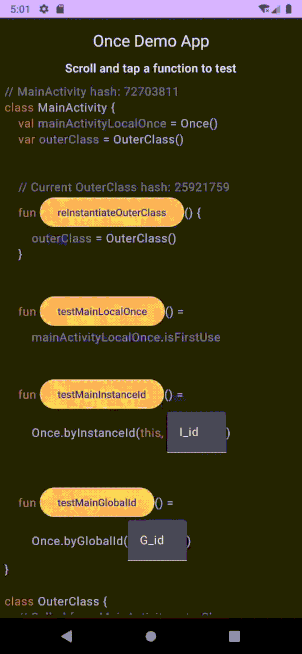

# Once

### Simple app demonstrating different uses of Once.
 

<table>
<tr>
<th>Local Variable Example</th>
<th>Instance Id Example</th>
<th>Global Id Example</th>
</tr>
<tr>
<td>

</td>
<td>

</td>
<td>

</td>
</tr>
</table>